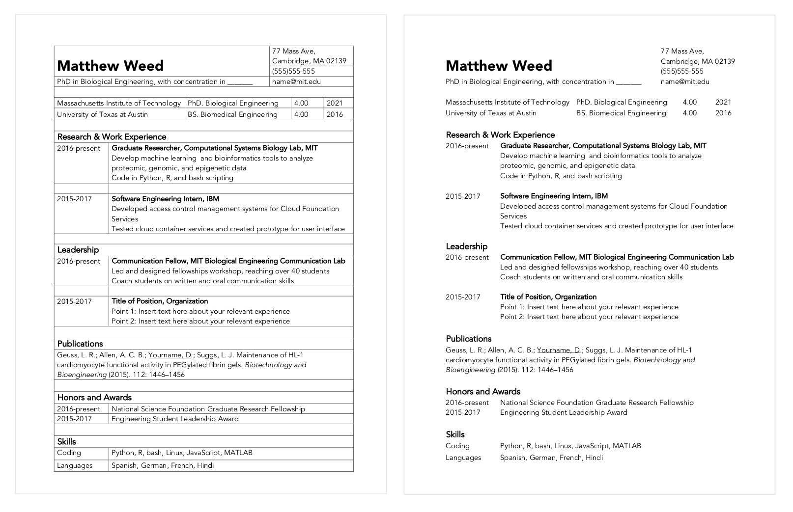
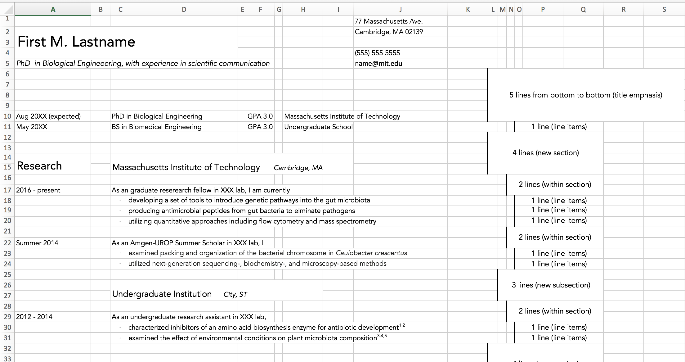

#  Resumes and CVs in Word, Excel, and LateX
*Compiled by*
Divya Ramamoorthy

*Support by*
Prerna Bhargava, Kyle McLean, Josh Peters, George Sun, Tyler Toth,
Alexander Triassi

**Last Updated: 6 December 2018**

---
## Introduction
This repository compiles basic Excel, Word, and LateX templates for
Curricula Vitaes (CV), as well as a cheatsheet on resume/CV for best practices
(targeted towards students in the sciences/engineering).

The three formats of resume offer different
benefits: Word and Excel are familiar to use and enable you to
easily edit the format of your document; by using tables in both, one can
easily delineate work and add additional rows as needed. LaTeX helps separate
content from format of your document. In particular, LaTeX can be used to keep
sections of a resume organized and
sections can be easily commented out or modified in a modular way, enabling
a user to maintain one long document that contains all of the information about
their past experiences while only showing the desired experiences in the final
formatted document.

## Word and Excel Templates
Tables are a powerful way to organize your resume, and Microsoft software makes
it easy to customize your table structure.

Word:

Tables are used to set up the word document, with each row indicating an
information block. Table lines can be adjusted depending on desired margins by
clicking and dragging the gridline.

Excel:

Rows in excel are used to evenly space content, while allowing one to place
emphasis on particularly important content like section headers. Rows can be
inserted or deleted as needed to adjust the space allocated for each listed
experience.

## LateX Template
Creating your resume in LateX gives you the ability to quickly modify modular
sections of your resume and allows you to comment out sections of your resume
depending on your version, preventing the need to have multiple copies of
separate resume documents for different applications.

### Setting up LateX
To set up a desktop version of LateX, follow (https://mit-becl.github.io/LaTeX-intro/).
This is especially helpful to do when working on very large documents or if you
want to be able to work offline.

If you don't want to take the time to set up LateX on your computer, you can
also use free online editors, like Overleaf (http://overleaf.com). To start, make
an account and create a new project. To start your resume, you can either directly
import this GitHub repository or download the files here and upload them on your
Overleaf project. When importing your file, set your Compiler to be "XeLaTex" and
your Main document as "resume.tex"

### Organization of LateX template
This template is organized in a hierarchical file structure, with the following
elements:
- resume.tex: your main document. This is where you can edit the resume headers
and re-order, add, and remove sections.
- awesome-cv.cls: your template. This is the file that governs the aesthetics of
how you want your document to look. If you're an advanced user, you can edit
this file to modify the layout of your resume
- resume folder: this folder contains a file for each section of your resume.
This is where you can add information about your education, work experience,
publications, honors & awards, and skills. Comments (adding a % in front of
your line of code) can be used to help keep these sections organized - you can
comment out old experiences so they don't appear in your resume but can easily
be viewed in your latex document. This can be particularly useful when making
multiple versions of your resume.

###

## Getting Started
The files within this repository can be downloaded by clicking the blue "View on GitHub" button above and using the green "clone or download" button.

Inside this repository, you will find:
  - [CV & Resume Guidelines](https://raw.githubusercontent.com/MIT-BECL/CV_Resources/blob/master/CV_Resume_Guidelines.pdf)  - guides on principles to remember when creating
  your resume
  - Word CV Template
  - Excel CV Template
  - LateX CV Template
